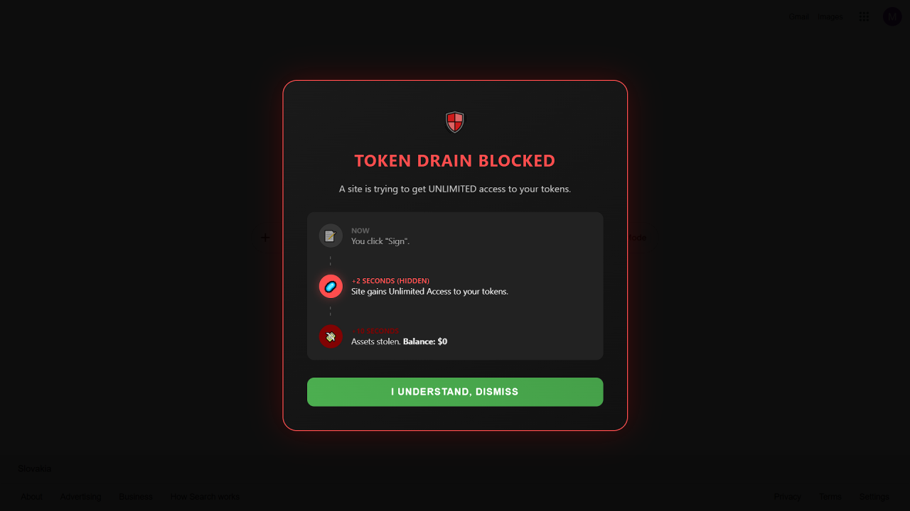
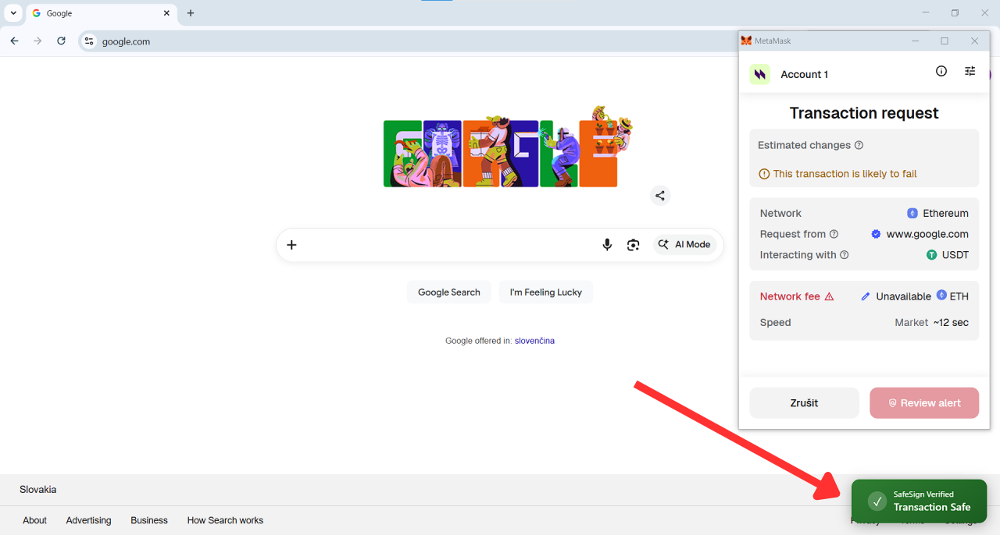

# 🛡️ SafeSign Visualizer

The Visual Security Layer for Crypto Wallets.
Stop guessing what you're signing. See the consequences.

[Features](#features) • [Screenshots](#screenshots) • [Installation](#installation-from-source-developers) • [Roadmap](#roadmap) • [Contributing](#contributing)
## 🚀Features
Visual Time-Travel UI: Don't read hex codes. See a visual timeline of exactly what happens if you sign (e.g., "Wallet Drained").
Unlimited Approval Blocker: Automatically blocks transactions asking for infinite token spending permissions.
NFT Drain Protection: Detects and blocks setApprovalForAll scams that steal entire NFT collections.
Real-Time Green Light: Get instant confirmation when a transaction is verified safe.
Universal Compatibility: Works with MetaMask, Coinbase Wallet, Rabby, Brave Wallet, and any window.ethereum provider.
## 📸Screenshots
**The Warning (Time-Travel UI)**

**The Safe Verification**

## 📥Installation From Source (Developers)
1. Clone the repo:
`git clone https://github.com/XenoVenom/safesign-visualizer.git`
2. Install dependencies:
`pnpm install`
3. Run the development server:
`pnpm dev`
4. Load the extension in Chrome:
 + Open `chrome://extensions`
 + Enable "Developer Mode"
 + Click "Load Unpacked"
 + Select the `build/chrome-mv3-dev` folder.
## 📆Roadmap
:white_check_mark: Core Interception Engine 
:white_check_mark: Visual Warning UI (Time-Travel) 
:white_check_mark: Token & NFT Drain Protection 
- [ ] Permit Signature Protection (EIP-2612) 
- [ ] Community-Sourced Blacklist
## 🤝Contributing
We welcome contributions! If you have suggestions for new heuristics or UI improvements, please open an issue or a pull request.

## 📄License
MIT License
