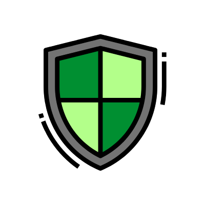
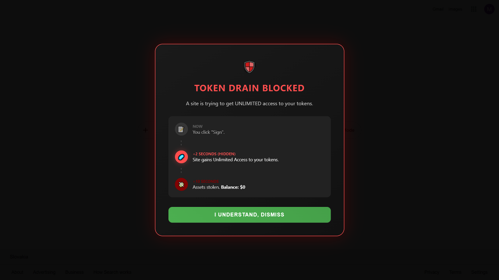
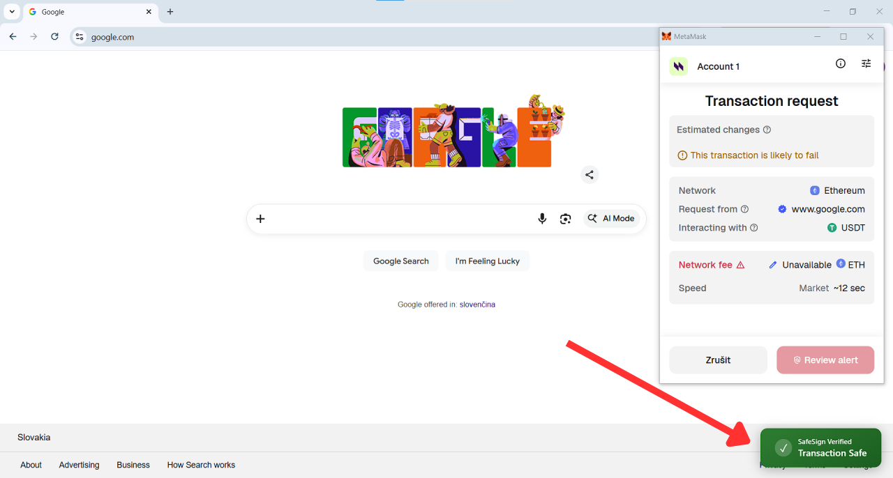
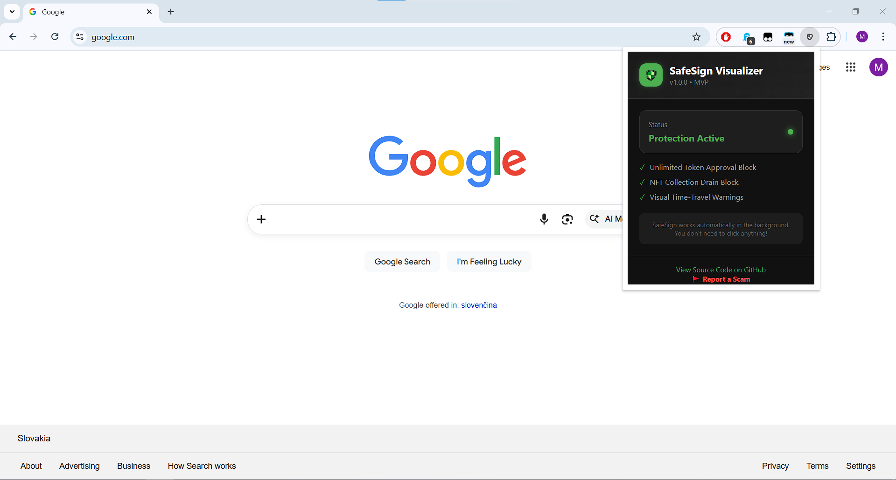

# 🛡️ SafeSign Visualizer

The Visual Security Layer for Crypto Wallets.
Stop guessing what you're signing. See the consequences.

[Features](#features) • [Screenshots](#screenshots) • [Installation](#installation-from-source-developers) • [Built With](#%EF%B8%8Fbuilt-with) • [Roadmap](#roadmap) • [Contributing](#contributing) • [Privacy Policy](#privacy-policy) • [Changelog](#%EF%B8%8Fchangelog) • [Disclaimer](#%EF%B8%8Fdisclaimer) • [License](#license)
## 🚀Features
**Visual Time-Travel UI:** Don't read hex codes. See a visual timeline of exactly what happens if you sign (e.g., "Wallet Drained").  
**Unlimited Approval Blocker:** Automatically blocks transactions asking for infinite token spending permissions.  
**NFT Drain Protection:** Detects and blocks setApprovalForAll scams that steal entire NFT collections.  
**Real-Time Green Light:** Get instant confirmation when a transaction is verified safe.  
**Universal Compatibility:** Works with MetaMask, Coinbase Wallet, Rabby, Brave Wallet, and any window.ethereum provider.
**Community-Sourced Blacklist:** Fetches a live list of verified scam addresses from GitHub, automatically blocking known wallet drainers in real-time.
## 📸Screenshots
<table>
<tr>
<td style="border: none"><b>:warning:The Warning (Time-Travel UI)</b></td>
<td style="border: none"><b>:heavy_check_mark:The Safe Verification</b></td>
</tr>
<tr>
<td style="border: none"></td>
<td style="border: none"></td>
</tr>
 </table>
 <table>
<tr>
<td><b>🛡️ The Dashboard</b></td>
 </tr>
 <tr>
<td></td>
</tr>
</table>

## 📥Installation From Source (Developers)
1. Clone the repo:
`git clone https://github.com/XenoVenom/safesign-visualizer.git`
2. Install dependencies:
`pnpm install`
3. Run the development server:
`pnpm dev`
4. Load the extension in Chrome:
 + Open `chrome://extensions`
 + Enable "Developer Mode"
 + Click "Load Unpacked"
 + Select the `build/chrome-mv3-dev` folder.
## 🛠️Built With
+ [Plasmo](https://www.plasmo.com/) - The Browser Extension Framework
+ [React](https://react.dev/) - UI Library
+ [TypeScript](https://www.typescriptlang.org/) - Language
+ Love & Security ❤️
## 📆Roadmap
:white_check_mark: Core Interception Engine (EIP-1193) 
:white_check_mark: Visual Warning UI (Time-Travel) 
:white_check_mark: Unlimited Token Approval Block (ERC-20) 
:white_check_mark: Token & NFT Drain Protection 
:white_check_mark: Community-Sourced Blacklist 
- [ ] Permit Signature Protection (EIP-2612) 
- [ ] Permit Signature Protection (EIP-4361) 
- [ ] Transaction Simulation 
- [ ] Power User Mode 
- [ ] Honeypot & Rugpull Detection 
- [ ] Multi-Chain Expansion 
## 🤝Contributing
We welcome contributions! If you have suggestions for new heuristics or UI improvements, please open an issue or a pull request.  
We believe in the power of community to fight scammers. You can help in two ways:  
**1. Code Contributions:** Submit a Pull Request with new features or heuristics.  
**2. Scam Reporting:**  
 + Click the **"Report a Scam"** button in the extension popup.  
 + Or fill out our [**Google Form**](https://forms.gle/2zP7nH2rmxL8RfJp6).

Once a report is verified, it will be added to the SafeSign blocklist in future updates to protect all users.
## 🔒Privacy Policy
SafeSign respects your privacy.

+ **No Data Collection:** We do not collect, store, or transmit any personal data, wallet addresses, or private keys.  
+ **Local Processing:** All transaction analysis happens locally in your browser. Nothing is sent to external servers.  
+ **Permissions:** The extension requires permission to access websites solely to intercept transaction requests from your wallet. It does not read your browsing history or personal information.

## 🗓️Changelog
**v1.1.0** 
✨ Added: Community-sourced live blacklist (fetches verified scam addresses from GitHub). 
✨ Added: New "Known Scam Blocked" visual warning state in the Time-Travel UI. 
🛠️ Improved: Engine performance for faster transaction analysis. 

**v1.0.0** 
🚀 Initial Release: Unlimited Token Approval blocker & NFT Collection Drain blocker. 
🚀 Initial Release: Visual Time-Travel Warning UI & Green Safe Toast. 

## ⚠️Disclaimer
SafeSign Visualizer is provided "as is" for educational and security enhancement purposes. While it aims to detect and prevent common scam patterns, it is not a guarantee of absolute security.

+ New scam techniques are developed daily.
+ Users should always exercise caution and verify transaction details manually.

The developers assume no liability for any financial losses incurred while using this software. Use at your own risk.

## 📄License
MIT License

